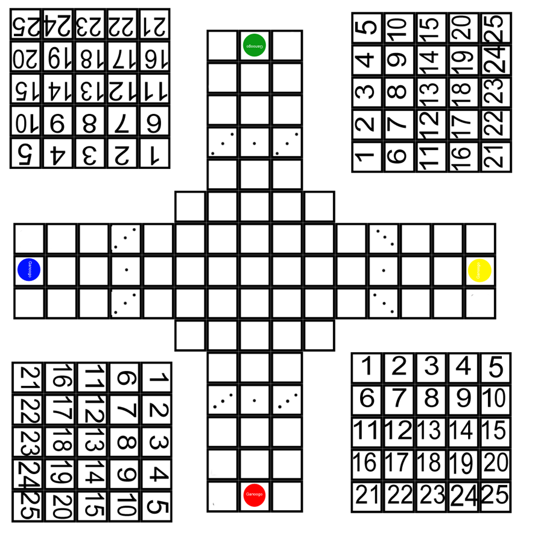

##Ganoogo
Battle royale dice battler for 2-4 players

## Board

The board is inspired by a Parcheesi board.

## Tabletop Simulator
Available on tabletop simulator:
https://steamcommunity.com/sharedfiles/filedetails/?id=2488308402&searchtext=ganoogo

## How to generate card
Open up Hccd with java:
`java -jar Hccd.jar`

Set the following configuration:
Rows: 3
Columns: 3
CSV format: RFC-4180
Delimiter: ,

Open up ganoogo.html which will create a "ganoogo-GENERATED.html".

Use the "Refresh" button after making any changes to regenerate the file.

## License
Licensed under GPL V3.

HCCD is licensed under GPL V3.

## Resources
- HCCD - HTML+CSS Card Designer
https://github.com/vaemendis/hccd
