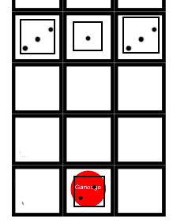
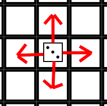

# Ganoogo
Battle royale dice battler for 2-4 players

## Players
2-4

## Goal
The player’s goal is to be the last player standing. A player can be eliminated from the game by capturing their opponents’ Ganoogo squares or eliminating all of their dice.

## Terminology
HP – Hit Points – A piece’s face value. A die is removed from play when its HP reaches 0.
MP – Movement Points - MP is used to either move a piece 1 space or engage in 1 conflict roll. 5 MP can be used to draw an additional card. A player gains
Ganoogo – Sacred battle initiated when a player’s die reaches an opponent’s Ganoogo square.

## How to Play
Players roll to see who goes first and play goes clockwise.
Each player is dealt five cards to start with.

## Starting Position:
Place the appropriately colored die as seen here.

## Die:
Ganoogo Overlord(1) – Starts on the Ganoogo square and cannot leave the Ganoogo square unless all other die have been eliminated. It has 2 HP.
Ganoogo Minions(3) – Starts on appropriate squares with appropriate HPs. Can move freely.

## Movement Phase

Players start off each turn by drawing a card and rolling 2 six sided die.

The number the player rolls is the amount of Movement Points (MP) the player receives for the turn.

A player can use MP for movement, attacking, or drawing additional cards. 1 MP can move a die one space or MP can be used in conflicts. A player can draw an additional card for 5 MP. A player does not have to use all of his or her MP but MP does not carry over to other turns. Two pieces can’t occupy the same space.

A playing piece of appropriate color and grids with numbers are provided to help players keep track of MP.

## Conflict Phase
A conflict can occur when a player’s die is in an adjacent space to an opponent’s die. The player uses 1 MP to initiate a conflict. Each roll after the initial roll costs an additional 1 MP. Both players will roll 2 die and combine the value. The player with the lower combined value loses the conflict and the losing die’s HP decreases by 1. The defender wins ties. If a die’s HP reaches 0 that die is removed from the board. When cards refer to “for 1 conflict”, they are referring to the set of contiguous attacks on 1 die in 1 turn.

## Ganoogo
When a player reaches the other player’s Ganoogo square, he or she initiates Ganoogo. By initiating Ganoogo, a player forfeits the rest of his or her movement points for that turn. The players roll 3 dice each; best out of 3 rolls wins the Ganoogo (basically you have to win twice). Ties are rolled again. If the defender loses, he or she is eliminated from the game and the attacker gains control of any remaining dice. If the attacker loses, the die’s value decreases by 1 and the defender rolls three dice and moves the player’s die that many spaces.

## Cards
All cards have a category, a description, and a limit. The categories are Roll Modifier, Negate, Luck, Die Modifier. Roll Modifiers typically impact the value of rolls. Die Modifiers affect the dice on the board (addition HP, bring die back after it has been eliminated, etc.). Negate will usually negate an action (rerolls, negate card effects, lose turn etc.). Luck cards usually involve an element of chance (flip token, lowest roll wins a conflict, draw additional cards, etc.).The description details what exactly the card does. The limit dictates when a card can be used. Cards can be used on any player at any time (limit permitting).
